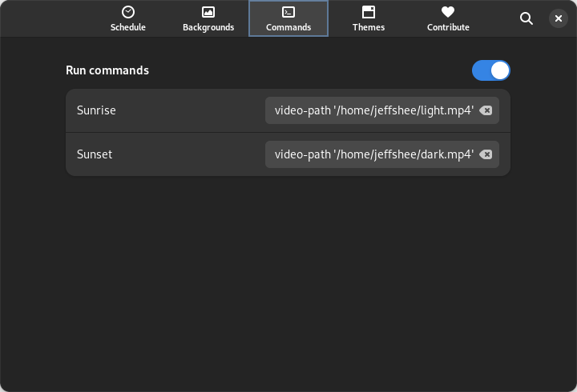

# Scripting Guide

The Hanabi extension can be extended and automated using scripts, allowing users to customize their wallpaper experience.  
This guide provides an overview of how to use scripts to interact with the Hanabi extension.

## Using gsettings

You can modify all Hanabi extension settings through the `gsettings` command.

For example, to change the video path, use the following command:

```bash
gsettings set io.github.jeffshee.hanabi-extension video-path '<video_path>'
```

Replace `<video_path>` with the path to the video file you want to set as your wallpaper.

### Example: Switching Wallpaper with Night Theme Switcher Extension

When using the Hanabi extension in combination with the [Night Theme Switcher Extension](https://gitlab.com/rmnvgr/nightthemeswitcher-gnome-shell-extension/) by Romain Vigier, you can run different commands to switch wallpapers based on the selected theme.

Here's how to do it:

- Sunrise

```bash
gsettings set io.github.jeffshee.hanabi-extension video-path '<light_theme_video_path>'
```

- Sunset

```bash
gsettings set io.github.jeffshee.hanabi-extension video-path '<dark_theme_video_path>'
```



#### Result 😍


## Writing scripts

_Note: You can find all the example scripts in the `docs/scripts` directory._

### Example: Random Wallpaper

You can write a script that randomly selects a wallpaper from a directory and sets it as your wallpaper at specified intervals.

Here's a sample script in Python:

```python
import os
import random
import subprocess
import time

dir_path = '/path/to/wallpaper/directory' # Set the path to your directory
video_exts = ['.mp4', '.webm']
interval = 30 # Set the interval in seconds

while True:
    video_paths = []
    for root, _, files in os.walk(dir_path):
        for file in files:
            if any(file.lower().endswith(ext) for ext in video_exts):
                video_paths.append(os.path.join(root, file))

    if video_paths:
        video_path = random.choice(video_paths)
        gsettings_command = f"gsettings set io.github.jeffshee.hanabi-extension video-path '{video_path}'"
        print(f"Video path: {video_path}")
        subprocess.run(["bash", "-c", gsettings_command])

    time.sleep(interval)
```

## Contributing

If you've created a useful script, please consider submitting a pull request, making it available for others to use!

When submitting, please include your script in the `docs/scripts` directory.

Contributions to improve this guide are also welcome! ✨
